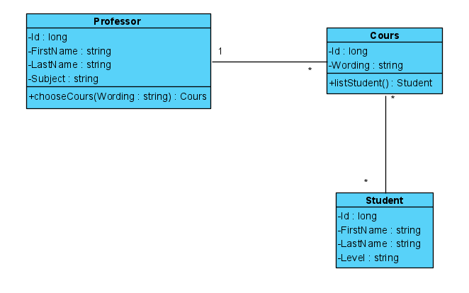
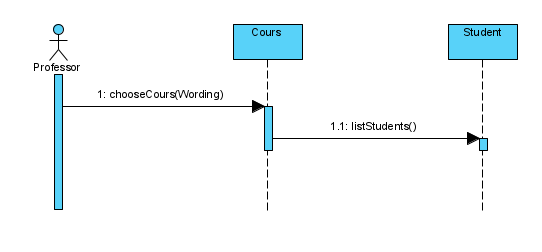
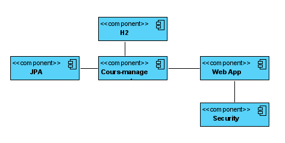

J'ai récupéré la user story de Gabriel Couroux et ses diagrammes, les voici : 

User Story : en tant que professeur je veux pouvoir voir la liste des etudient inscrit a un de mes cours afin de pouvoir faire l'apelle au moment du cours

Diagrammes : 

